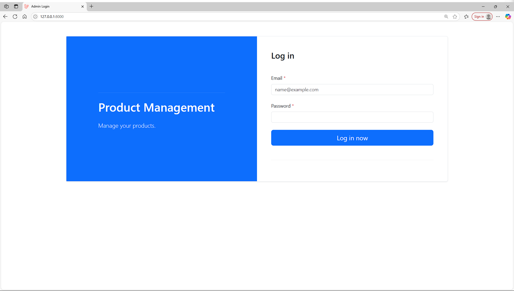
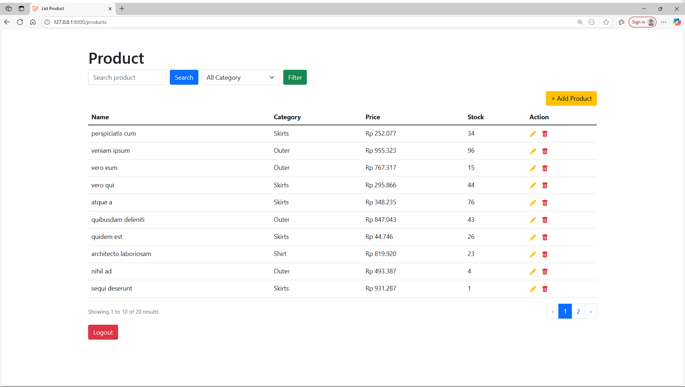
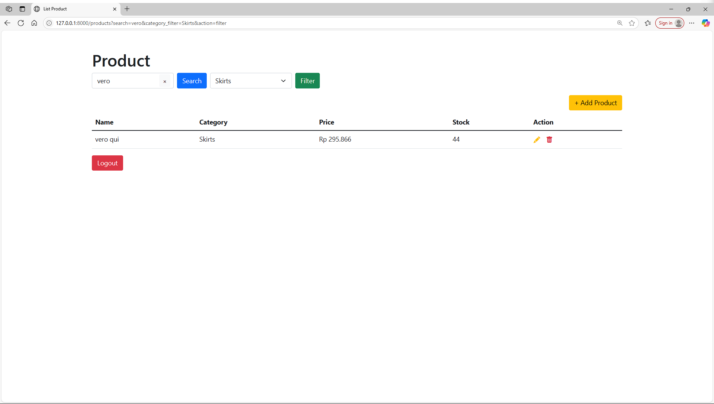
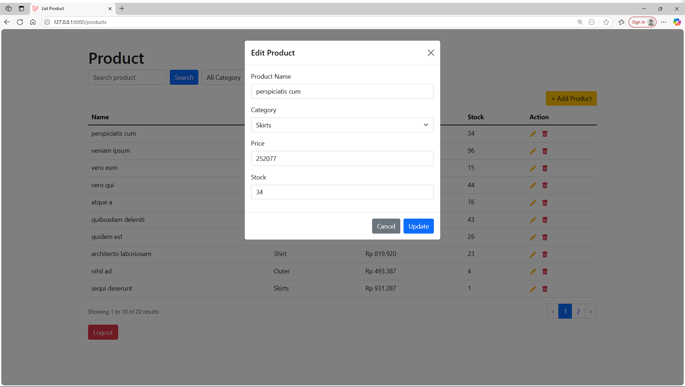

## 🛒 Product Management System

A simple Laravel app with admin login, product CRUD (add, edit, delete), search, category filter, pagination and responsive interface.

## 🚀 Tech Stack

- Frontend : Bootstrap UI
- Backend : Laravel
- Database : MySQL

## 📸 Screens

  

    <strong>Login Page</strong> 
    
  

  

    <strong>Product Page</strong> 
    
  

  

    <strong>Search & Filter Result</strong> 
    
  

  

    <strong>Add/Edit Product Popup</strong> 
    
  

